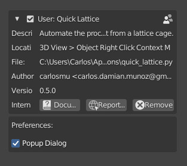
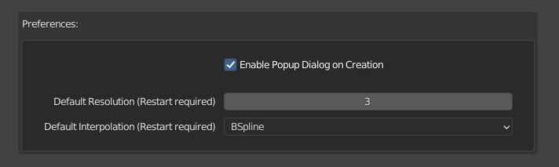

# Quick Lattice (Blender Addon) 
Tired of setting up lattices? 
Looking for a non-destructive way to modify your models? 
Quick Lattice is what you are looking for! Do not wait more! (hahaha) 

## What its does?
Automating the process of warping an object in a lattice cage. 
Setting the size, position, rotation, resolution, interpolation, modifier, etc. 
This will save you a lot clicks and other boring settings. But not much more.  

## Usage
1. Select the target object
2. Right Click Menú -> Quick Lattice (or W for Right Click Select Users)
  

  

  
## New features
 

  

## Instalation
1. Go to releases page: https://gumroad.com/l/quicklattice
2. Download the zip file "quick_lattice_[version].zip"
3. If you have an older version, uninstall it first (on addon preferences).
4. Go to Blender > User Preferences > Addons > Install (choose the .zip file)
5. Activate the addon.
6. Enjoy it!

## Changelog
- 0.3.0 First Release!
- 0.3.1 Fix: Crash On Undo, reported by BluePortal77 
- 0.4.0 Add Last Operation Support
  
- 0.5.0 Add Popup Dialog and User Preferences option
  
  
- 0.6.0 Add User Preferences to set the Default Resolution and Interpolation of Lattices
  
- 0.7.0 Now this addon use multifile structure (.zip)

## Donate
You can support my work by buying this plugin on Gumroad https://gum.co/quicklattice

## Known Issues
When the object's pivot is rotated (but not the whole object), the result may not be what you want. In those cases, try applying the rotation first (Ctrl + A).
  

  

## Report a Bug
If you have any problem, report it on Addon Preferences. I will solve it as soon as possible. 

  

## To-Do List for 1.0 Milestone
- Wrap on a zip package = OK
- Multi Object option.
- Vertex Selection or vGroups.
- Add feature to set bones/empties to all points of lattice.
